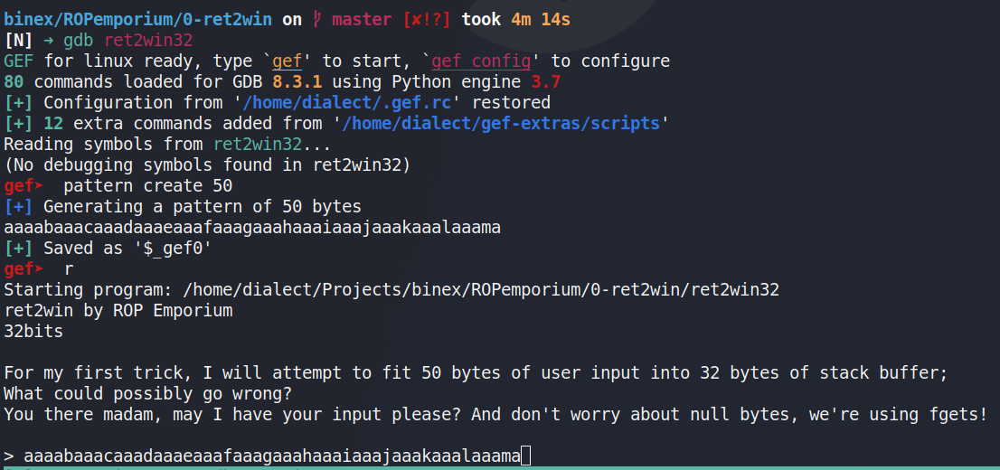
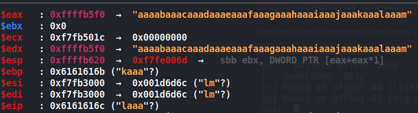
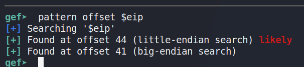
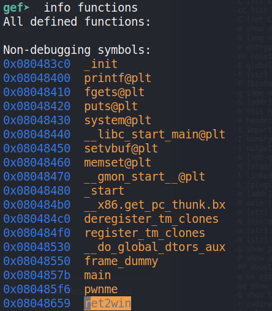
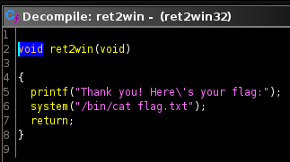
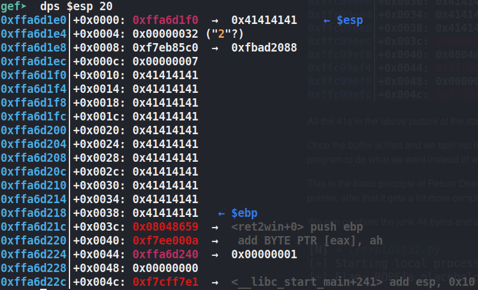
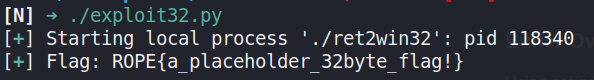

# RET2WIN - The First Step of ROP

## 32 bit

### Finding the Buffer Size

Use gef/gdb to find how larget the bufer is by making a de Bruijn cyclic pattern.

A de Bruijn cyclic pattern is a pattern that doesn't repeat so the program can easily find the exact spot that breaks the binary.



Looking at the registers we can see that the input spilled out of the intended buffer and into $eip
- $eip is the index pointer which is the register that holds the current instructon ie the current step or location in the code
- If we are able to modifiy it then we can modify what the program does




Using the following command gef can nicely give us the offset needed to break the buffer.



### Modifing the Instruction Pointer

Now that we are able to bump $eip and take control of where the program goes we need to find where we want it to go

Looking at all the functions in the file we find one that isn't called by main and isn't just a normal C function `ret2win`



If we open it up in ghidra we get a pretty cool decompiled view of the function, showing exactly what it does.

And perfect! We want to cat the flag.txt file.



From the gdb output we can see the address of the function `0x08048659`

If we append that address to the end of the 44 bytes of garbage then the address of ret2win will overwrite $eip.

In python we can use pwntools to easily assemble this string
```
from pwn import *
junk = ("A"*40).encode # we encode the string so it can concatinated with the address of ret2win
payload = junk + p32(0x08048659) #use pwntools to get the python lib pwn it makes packing address painless
```



All the 41s in the above picture of the stack are the As we used in the junk var to overflow the buffer.

Once the buffer is filed and we spill out onto the stack and later overwriting $eip.

Allowing us to changing the flow of the program to do what we want instead of what was intended.

This is the basic principle of Return Oriented Programming (ROP), overflow the buffer and take controle of the instruction pointer, after that it gets a lot more complicated but that is the basics.

We can combine the junk 44 bytes and our 'payload' containing the address of the function we want to into a nice python [script](exploit32.py)



## 64 bit

The same as above but the address that we will be jumping to will need to be in a 64bit format.

So if you are using pwn it will be `p64(0xdeadbeef)` vs `p32(0xdeadbeef)` a really huge and complicated diffrence.


