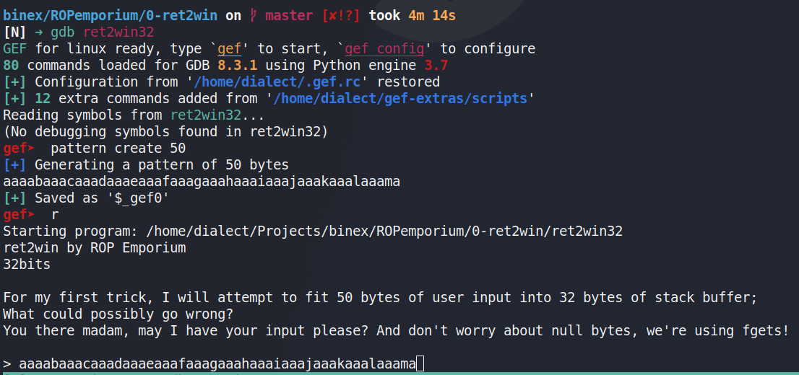
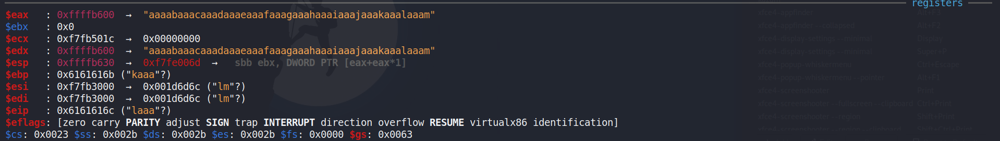
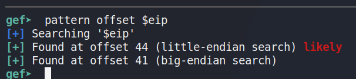
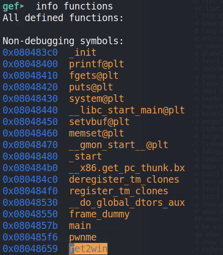
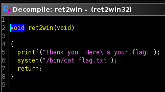

# RET2WIN

## 32 bit

### Buffer Overflow

Using gef/gdb to find how larget the bufer is by making a de Bruijn cyclic pattern.
Which is a pattern that doesn't repeat so the program can easily find the exact spot that breaks the binary.

I created a pattern of length 50 to see where the buffer breaks

Looking at the registers we can see that the input spilled out of the intended buffer and into $eip (the index pointer which is the register that holds the current instructon ie the current step in the code)

Using the following command gef can nicely give us the offset needed to break the buffer.

Now that we are able to bump $eip and take control of where the program goes we need to find where we want it to go

Looking at all the functions in the file we find one that isn't called by main and isn't just a normal C function `ret2win`

If we open it up in ghidra we get a pretty cool decompiled view of the function

## 64 bit
