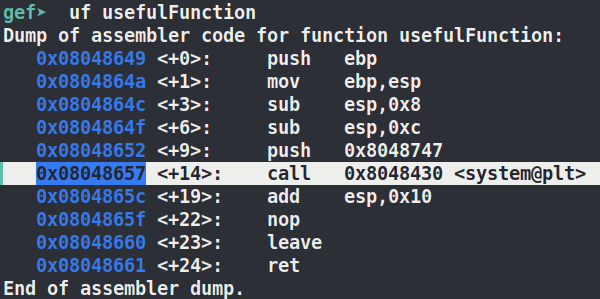

# SPLIT


## 32 bit

Once again fire up gef-gdb and locate the offset needed to file the buffer. `44 bytes` once again!

If we fire up ghidra and look at the disasm and the decompiled sections we see that sadly there is no magical function for us to call and win.
We actually have to try and do something.

### Useful Function & String

But there's still hope!
There's this cool useful function waiting to be used but sadly its got a gross parameter of `/bin/ls`




Luckily there's also a useful string for us to use. Go into ghidra and search for `bin` in program text then data values and you'll get:
```
0804a030	usefulString	Global	ds "/bin/cat flag.txt"
```

You can also see it by just navigating to the `.data` section of the code


### Puting it all together

Alright so now that we have both a usefulFunction and a usefulString we can make a magic payload!

Payload:

```python
junk = ("A"* 44).encode() # once again the string needs to be encoded(bytes) so that it can be concated the paccked addresses(bytes)
system = p32(0x8048657)
#system = p32(0x8048430)
cat = p32(0x804a030)
payload = system+arg
```

We need the 44 bytes of junk to overflow the buffer so then the adress of where system gets called can overflow into $eip and change the flow of the program
All the \x41s are the As we use as the junk to fill up the buffer.
Then when we leave the function the stack pointer is incremented and it pops the "return address" off of the stack but instead of the real return address being poped off the stack the address to `system` is poped


Then after system address is pushed on the stack we push the address of the useful string aka `/bin/cat flag.txt` onto it so when we go to the `system` function call it'll pull `/bin/cat flag.txt` as the argument off the stack


## 64 bit
